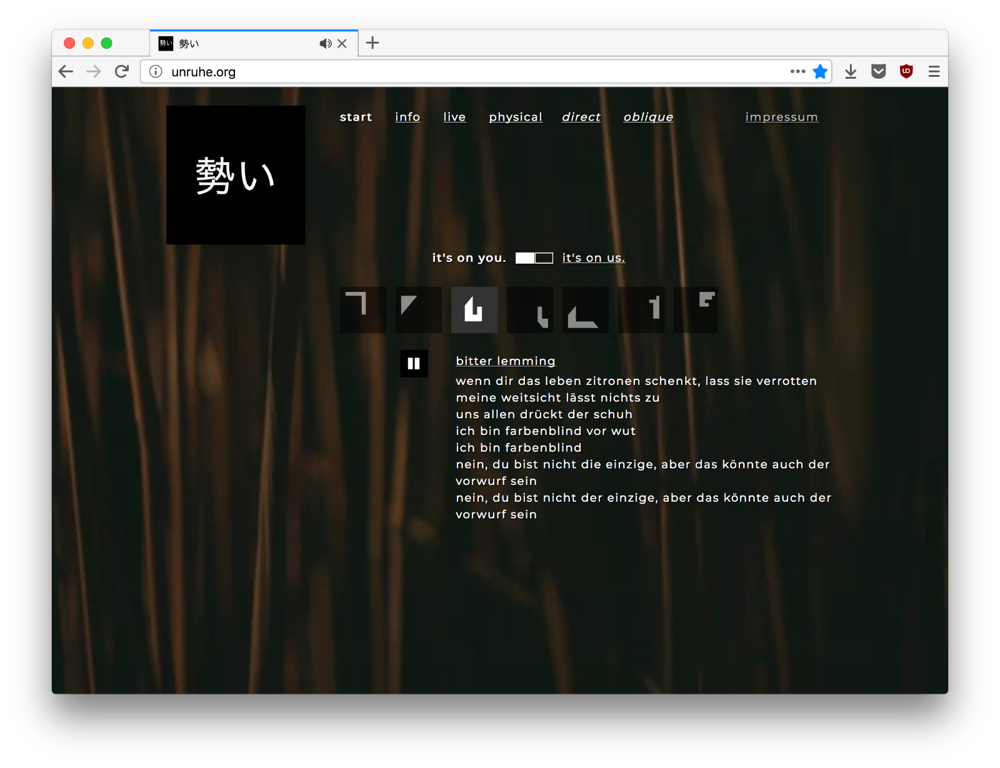

# 勢い

Website for the band 勢い aka [unruhe.org](http://unruhe.org).




## Prerequisites

- Node v16.x with npm
- Install dependencies with `npm install`


## Run local development server

```bash
npm run watch
```


## Build & deployment

1. Adjust the version number in `package.json`
2. Compile the app via `npm run compile`
3. Upload results from `compile` dir to the server
